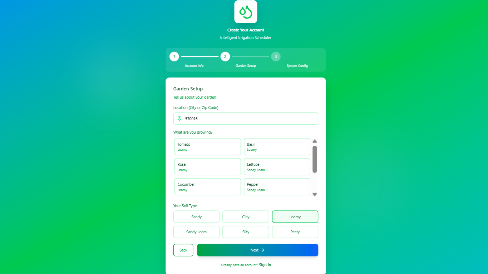
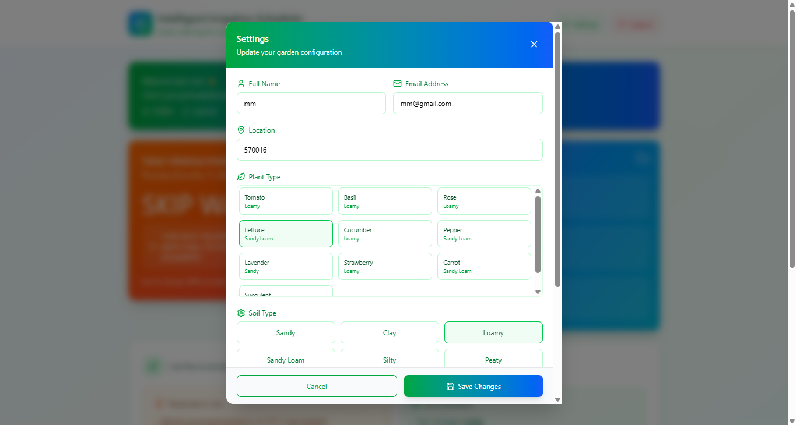

##  Project Overview
**Team Name:** Tech Twins
**Track:** Sustainability & Climate Tech
**College:** GSSS Institute Of Engineering and Technology for Women

The **Intelligent Irrigation Scheduler** is a solution designed to move residential and small-scale watering practices beyond static timers and guesswork. By integrating localized, real-time weather data with a plant-specific database, the tool generates a dynamic, predictive watering schedule.

Our primary objective is to develop a tool that achieves an estimated **20-40% reduction in unnecessary water consumption** while ensuring optimal plant health.

##  Technology Stack

| Component | Technology | Rationale |
| :--- | :--- | :--- |
| **Backend** | Python (Flask/Django) | Highly recommended for its powerful libraries (`requests` for API) to handle data processing and implement the core E.T. optimization algorithm. |
| **Database** | **MongoDB** | A flexible NoSQL database used to efficiently store and retrieve plant-specific parameters, user schedules, and historical watering logs. |
| **Frontend/UI** | HTML, CSS, JavaScript | Standard web technologies for the user interface, prioritizing rapid development (Vanilla JS or React) for the hackathon. |
| **UI/UX Design** | **Figma** | Used for collaborative design, rapid prototyping, and creating high-fidelity mockups of the intuitive dashboard and setup screen. |
| **External API** | **OpenWeatherMap** | Provides the necessary localized, real-time current conditions (Temperature, Humidity) and forecast data (Predicted Rainfall) for the algorithm. |

##  The Problem
Homeowners and small farmers lack accessible, intelligent tools that generate truly **optimal and dynamic watering schedules**. Current practices rely on static timers, leading to massive water waste and sub-optimal plant health. A solution is needed that uses **precise, predictive, and need-based water application**.

##  Key Features

The solution is built around a simple, proactive interface for automated savings.

* **1. Setup Screen & Guided Configuration:**
    * User inputs their **Location** (Pin Code) and **Crop Name** once.
    * The system automatically fetches the crop coefficient ($K_c$) and sets up the daily automation cycle (e.g., runs at 5:00 AM).
* **2. Data-Driven Scheduling (E.T. Engine):**
    * The core logic uses **Evapotranspiration (E.T.)** to calculate precise water loss and the current soil moisture deficit.
    * Integrates **location-specific weather data** from APIs (specifically **OpenWeatherMap**).
* **3. Optimized Output & Rain Skip Logic:**
    * Provides the optimal watering schedule, including an exact duration.
    * Utilizes **Rain Skip Logic** based on the 7-day forecast to skip watering and maximize water savings.
* **4. Transparency & Proactive Notifications:**
    * **Dashboard:** Displays the simulated Soil Moisture (SM) level and a visible **Total Water Saved** metric, building user trust and quantifying the sustainability impact.
    * **Actionable Alerts:** Sends immediate alerts (Email/SMS) for a Rain Skip (with reasoning) or a Precision Watering Command (with exact duration).

##  Methodology Overview

The system runs a **Daily Automated Cycle** (e.g., at 5:00 AM).

### **The Core Algorithm**

The water need is calculated by first determining the Reference Evapotranspiration ($ET_o$) and then adjusting for the specific crop using the Crop Coefficient ($K_c$).

1.  **Data Ingestion:** Fetch Latest Weather & Forecast from **OpenWeatherMap**.
2.  **Calculate Crop E.T. ($ET_c$):** The system updates the E.T. process using the formula:
    $$ET_c = K_c \times ET_o$$
3.  **Run Decision Logic:** Evaluate E.T. and Soil Moisture (SM) Deficit, and then perform a Rain Check.
4.  **System Communication:** Proactive notification sent to the user (Email/SMS) via their preferred channel with the decision (e.g., **WATERING SKIPPED** or watering command).

##  Future Scope
The Intelligent Irrigation Scheduler has a significant future scope in **Scaling Precision for Sustainable Agriculture**.

* **Groundwater Conservation:** By preventing over-irrigation and eliminating "insurance watering," the tool directly helps slow the rate of groundwater decline, securing the resource for future generations.
* **Smart Farm Integration:** The tool can act as the central **Decision-Making Engine** for a fully Smart Farm.
* **Precision Agriculture:** It can integrate seamlessly with other technologies like **drones, soil chemistry sensors, and automated harvesting systems**, moving farming toward full precision agriculture.

